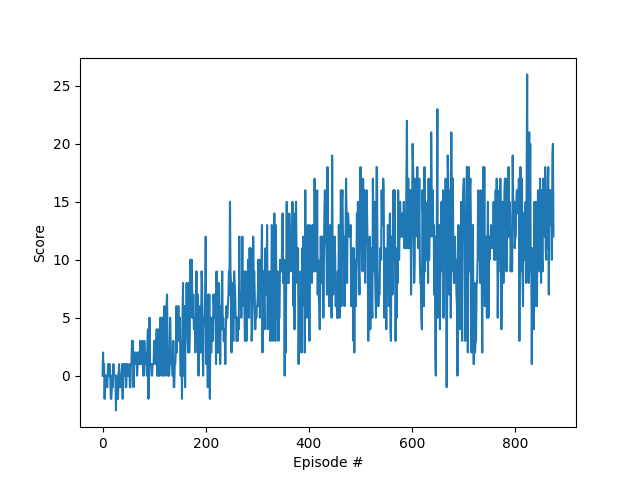

# Project Report

## Objective
This project has the objective to train an Agent using Deep Q Learning. The agent will be trained to collect yellow bananas while avoiding blue bananas from Unity's Banana Collector environment.
More information about Unix environment can be found [here](https://github.com/Unity-Technologies/ml-agents/blob/main/docs/Learning-Environment-Examples.md#banana-collector). The agent was trained using a Deep Q Learning algorithm and was able to solve the environment in 775 episodes.

## Enviroment & Task
The environment consists in a square world with yellow and blue bananas. The agent has the objective to collect as many yellow bananas as possible while avoiding the blue ones. The agent has 4 possible actions: move forward, move backward, turn left and turn right.
The state space has 37 dimensions and contains the agent's velocity, along with ray-based perception of objects around the agent's forward direction. A reward of +1 is provided for collecting a yellow banana, and a reward of -1 is provided for collecting a blue banana.
The task is episodic, and in order to solve the environment, the agent must get an average score of +13 over 100 consecutive episodes.

<div align="center">
    
</div>

## Implementation
To solve the problem given by the environment it was implemented a Deep Q Learning algorithm. The algorithm is based on the paper [Human-level control through deep reinforcement learning](https://storage.googleapis.com/deepmind-media/dqn/DQNNaturePaper.pdf) by DeepMind.

The algorithm works by using a neural network to approximate the Q-Function. The neural network receives the state as input and outputs the Q-Value for each action. Then it uses the Q-Value to select the best action to be taken by the agent. The algorithm learns by using the Q-Learning algorithm to train the neural network. There are also two problems to a simple implementation of the algorithm: correlated experiences and correlated targets. The algorithm uses two techniques to solve these problems: Experience Replay and Fixed Q-Targets.

### Correlated experiences
Correlated experiences refer to a situation where the experiences (or transitions) of an agent are correlated with each other, meaning they are not independent and identically distributed. This can lead to an overestimation of the expected reward of a particular state or action, resulting in poor performance or convergence to suboptimal policies.

 To solve this problem it is used a technique called Experience Replay. The technique consists in storing the experiences of the agent in a replay buffer and sampling randomly from it to train the neural network.

### Correlated targets
Correlated targets refer to a situation where the target values used to update the policy are not independent of each other, leading to correlation in the learning signal. This can slow down or prevent convergence to the optimal policy.

 To solve this problem it is used a technique called Fixed Q-Targets. The technique consists in using two neural networks: the local network and the target network. The local network is used to select the best action to be taken by the agent while the target network is used to calculate the target value for the Q-Learning algorithm. The target network is updated every 4 steps with the weights of the local network.

## Neural network architecture
The neural network architecture used in the algorithm is a simple fully connected neural network with 2 hidden layers. The input layer has 37 neurons, the output layer has 4 neurons and the hidden layers have 64 neurons each. The activation function used in the hidden layers is ReLU and the activation function used in the output layer is the identity function.

The optimizer used for this implementation is Adam with a learning rate of 0.0005.

The library used to implement the neural network was PyTorch.

This was the implementation of the neural network:


```python
import torch
import torch.nn as nn
import torch.nn.functional as F

class DQNetwork(nn.Module):
    """Actor (Policy) Model."""

    def __init__(self, state_size, action_size, seed, fc1_units=64, fc2_units=64):
        """Initialize parameters and build model.
        Params
        ======
            state_size (int): Dimension of each state
            action_size (int): Dimension of each action
            seed (int): Random seed
            fc1_units (int): Number of nodes in first hidden layer
            fc2_units (int): Number of nodes in second hidden layer
        """
        super(DQNetwork, self).__init__()
        self.seed = torch.manual_seed(seed)
        self.fc1 = nn.Linear(state_size, fc1_units)
        self.fc2 = nn.Linear(fc1_units, fc2_units)
        self.fc3 = nn.Linear(fc2_units, action_size)

    def forward(self, state):
        """Build a network that maps state -> action values."""
        x = F.relu(self.fc1(state))
        x = F.relu(self.fc2(x))
        return self.fc3(x)
```

## Training task

To train the agent we used a loop to interact with the environment, collect and learn from the experiences. One of the hyperparameters used in the training task was the number of episodes. This first hyperparameter was tuned manually trying to optimize the training time and the performance of the agent. The number of episodes used in the final implementation was 1200 however the env was solved in 775.

The second hyperparameter used in the training task was the number of steps per episode. This hyperparameter was also tuned manually trying to optimize the training time and the performance of the agent. The bigger the number of steps the more the agent can explore the environment but it increases a lot the training time. The number of steps per episode used in the final implementation was 1000.

Some other hyperparameters used:

- Replay buffer size: 1000
- Batch size: 32
- Update every: 4
- Gamma: 0.99
- Tau: 1e-3
- Learning rate: 0.0005

**Plot of rewards per episode:**


Here we can see the rewards increase as the agent improves. The tradeoff bewtween exploration and exploitation is also visible in the plot, where the agent explores more in the fist 200 episodes and then starts to exploit the environment and get higer rewards.

## Future improvements
The algorithm can be improved by using the following techniques:

- Dueling DQN - [paper](https://arxiv.org/pdf/1511.06581.pdf)
- Prioritized Experience Replay - [paper](https://arxiv.org/pdf/1511.05952.pdf)
